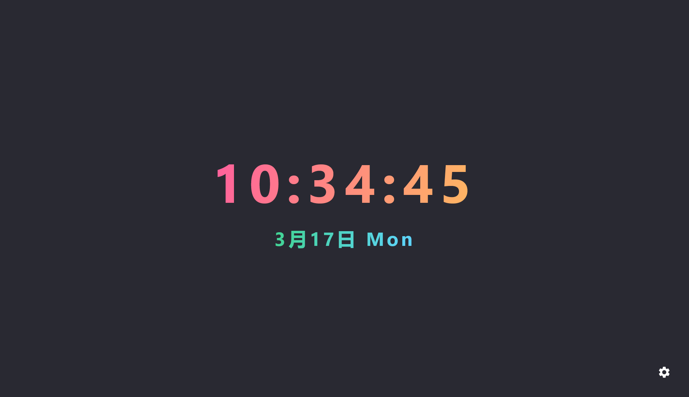

# Desktop-Clock

由于工作室里多出了一台电脑，我一直在思考如何更好地利用它，如果只是让它闲置，未免有些浪费，于是，我决定亲自动手编写一个既美观又实用的桌面时钟。

Since I had an extra computer in my studio, I kept thinking about how to make better use of it. It would be a waste to just leave it idle, so I decided to write a desktop clock that was both beautiful and functional.

This is a Kotlin Multiplatform project targeting Desktop.

* `/composeApp` is for code that will be shared across your Compose Multiplatform applications.
  It contains several subfolders:
  - `commonMain` is for code that’s common for all targets.
  - Other folders are for Kotlin code that will be compiled for only the platform indicated in the folder name.
    For example, if you want to use Apple’s CoreCrypto for the iOS part of your Kotlin app,
    `iosMain` would be the right folder for such calls.

Learn more about [Kotlin Multiplatform](https://www.jetbrains.com/help/kotlin-multiplatform-dev/get-started.html)…